# Connected Micro-services with Azure Arc using Kubernetes and SQL Managed Instance

## Introduction

Azure Arc provides a simplified *Governance* and *Management* capability by delivering a consistent multi-cloud and on-premises management platform. Azure Arc-enabled Kubernetes allows us to on-board and manage Kubernetes clusters running anywhere -  clusters running on other public cloud providers (*GCP* or *AWS*) or clusters running on on-premise data-centers (*VMware vSphere* or *Azure Stack HCI*) to Azure Arc. Azure Arc-enabled data services allows us to run Azure data services like *SQL Managed Instance* or *PostgreSQL Hyperscale (preview)* anywhere using Kubernetes.

## What this Article does?

In this article we will build an end-to-end flow of a connected set of simple micro-services and an SQL Managed Instance all deployed on an AKS cluster. The same example can be extended to deploy all the components onto any other cluster of choice - GKE, EKS or even on any un-managed cluster.

Following are the components to be deployed:

- **An Azure Function App** - This implemented the core business logic of Add, Update or Fetch from SQL MI database
- **A Logic App** - This implements the notification flow by sending emails to intended recipients and is triggered by the Function App
- **An SQL MI** - This holds the business data needed for the entire flow and can be accessed only from the above applications running within the cluster

All the above components will be running Privately within the AKS cluster and is exposed only through an Ingress Controller. This article would deploy this Ingress Controller as a *Public Load Balancer* for simplicity; but a more stringent and recommended approach would be make this Ingress Controller as an *Internal Load Balancer* with private IP and expose it only through an Application Gateway or API Management resource, thus making the InBound access more secure.

## Steps to build this

Following are the steps we would follow as we move on:

- Create a basic AKS Cluster. For simplicity, we would not add any additional security or features in this cluster
- **On-board** the cluster onto Azure Arc
- Deploy **Data Controller extension** for Arc
- Deploy **SQL MI** on Azure Arc
  - Connect and review the deployments
- Connect Data services running inside the cluster using the **Azure Data Studio**
- Deploy an **Azure Function App** as Container onto the AKS cluster
- Deploy **Logic App** as container onto the AKS cluster
- Deploy an **Ingress Controller** to provide access to the application and data services running inside the cluster - we would be using **Nginx** here and configure it as a Public Load Balancer
- Deploy **Ingress routing** within the cluster
  - Application Ingress
  - Data Monitor Ingress
- Test the Application flow end-to-end using **Postman**

## Let us delve into this

### Prerequisites

- An active Azure Subscription
- A Github account (optional)
- [kubectl](https://kubernetes.io/docs/tasks/tools/)
- [Azure CLI](https://docs.microsoft.com/en-us/cli/azure/install-azure-cli)
- [Azure Data Studio](https://docs.microsoft.com/en-us/sql/azure-data-studio/download-azure-data-studio?view=sql-server-ver15)
- [Visual Studio Code](https://code.visualstudio.com/download)(Optional) or any other preferred IDE

### Prepare Environment

Let us prepare the environment first even before creating the AKS cluster

- Set **CLI** variables
- Create **Service principals**
- Create **Virtual Networks**
- Create **Azure Container Registry**

#### Set CLI Variables

```bash
tenantId="<tenantId>"
subscriptionId="<subscriptionId>"
arcResourceGroup="arc-k8s-rg"
aksResourceGroup="aks-k8s-rg"
arcsvcResourceGroup="arc-services-rg"
location="eastus"
clusterName="aks-k8s-cluster"
version=1.22.4
acrName=aksk8sacr
acrId=
aksVnetName=aks-k8s-vnet
aksVnetPrefix="<Address prefix of the Vent to host AKS cluster>"
aksVnetId="<To be set later>"
aksSubnetName=aks-k8s-subnet
aksSubnetPrefix="<Address prefix of the Subnet to host AKS cluster>"
aksSubnetId="<To be set later>"
sysNodeSize="Standard_D8s_v3"
sysNodeCount=3
maxSysPods=30
networkPlugin=azure
networkPolicy=azure
sysNodePoolName=arcsyspool
vmSetType=VirtualMachineScaleSets
addons=monitoring
connectedClusterName="aksarccluster"
```

#### Login to Azure

```bash
az login --tenant $tenantId
```

#### Create Resource groups

```bash
# Resoure group for all Arc-enabled resources
az group create -n $arcResourceGroup -l $location
```

```bash
# Resoure group for all AKS cluster and related resources
az group create -n $aksResourceGroup -l $location
```

```bash
# Resoure group for all Application services
az group create -n $arcsvcResourceGroup -l $location
```

#### Create Virtual Network

```bash
az network vnet create -n $aksVnetName -g $aksResourceGroup --address-prefixes $aksVnetPrefix
aksVnetId=$(az network vnet show -n $aksVnetName -g $aksResourceGroup --query="id" -o tsv)
echo $aksVnetId
```

#### Create Subnet to host the AKS cluster

```bash
az network vnet subnet create -n $aksSubnetName --vnet-name $aksVnetName -g $aksResourceGroup --address-prefixes $aksSubnetPrefix
aksSubnetId=$(az network vnet subnet show -n $aksSubnetName --vnet-name $aksVnetName -g $aksResourceGroup --query="id" -o tsv)
echo $aksSubnetId
```

#### Create Service Principals

> [!NOTE]
>
> - This is the legacy approach and should ideally be avoided for the Managed Identity approach, which is recommended
> - If we go with this approach (*i.e. Service Principal*) then we have to perform role assignment on various resources and we should do it even before creating the cluster
> - If we go with the Managed Identity approach, then majority of the role assignments are taken care of by AKS cluster creation script. Only thing we need to do additionally is to provide a *Monitoring Metrics Publisher* role to the Managed Identity attached to the AKS cluster. This should be done post the cluster creation

```bash
az ad sp create-for-rbac --skip-assignment -n arc-aks-sp
{
  "appId": "",
  "displayName": "arc-aks-sp",
  "name": "",
  "password": "",
  "tenant": ""
}
```

> [!NOTE]
>
> Note down the **appId** and **password** fields which we would be need ing it later. Let us call them as *spAppId*, *spPassword*

```bash
# Role assignment - Network Contributor to VNET
az role assignment create --assignee $spAppId --role "Network Contributor" --scope $aksVnetId

# Role assignment - Monitoring Metrics Publisher to the Resource group hosing the Arc-enabled services
arcResourceGroupId=$(az group show -n $arcResourceGroup --query="id" -o tsv)
az role assignment create --assignee $spAppId --role "Monitoring Metrics Publisher" --scope $arcResourceGroupId
echo $arcResourceGroupId
```

#### Create Azure Container Registry

> [!NOTE]
>
> This is needed to store container images of the applications to be deployed onto AKS cluster securely

```bash
# Create ACR
az acr create -n $acrName -g $aksResourceGroup --sku STANDARD --admin-enabled false
acrId=$(az acr show -n $acrName -g $arcsvcResourceGroup --query="id" -o tsv)
echo $acrId

# Role assignment - AcrPull to ACR
az role assignment create --assignee $spAppId --role "AcrPull" --scope $acrId
```

#### Create AKS Cluster

- We can create it using [Portal](https://docs.microsoft.com/en-us/azure/aks/learn/quick-kubernetes-deploy-portal) or [Azure CLI](https://docs.microsoft.com/en-us/cli/azure/aks?view=azure-cli-latest#az-aks-create)
- We will be taking the CLI approach

```bash
az aks create --name $clusterName \
--resource-group $aksResourceGroup \
--kubernetes-version $version --location $location \
--vnet-subnet-id "$aksSubnetId" --enable-addons $addons \
--node-vm-size $sysNodeSize \
--node-count $sysNodeCount --max-pods $maxSysPods \
--service-principal $spAppId \
--client-secret $spPassword \
--network-plugin $networkPlugin --network-policy $networkPolicy \
--nodepool-name $sysNodePoolName --vm-set-type $vmSetType \
--generate-ssh-keys \
--disable-rbac \
--attach-acr $acrName
```

#### Connect to the AKS cluster

```bash
az aks get-credentials -g $aksResourceGroup --name $clusterName --admin --overwrite
```

> [!TIP]
>
> - This command also configures the .kubeconfig on local machine
> - All subsequent commands for Azure Arc will take effect on this K8s cluster only

So we have now created a basic AKS cluster which will be hosting our Applications (*Azure Function* and *Logic App*) and SQL MI Database instance and help us to build an end-to-end use case

### On-board AKS cluster on Azure Arc

```bash
# Add Azure Arc extension for Azure CLI
az extension add --name connectedk8s

# Register following providers
az provider register --namespace Microsoft.Kubernetes
az provider register --namespace Microsoft.KubernetesConfiguration
az provider register --namespace Microsoft.ExtendedLocation
```

```bash
# on-board AKS cluster onto Azure Arc
az connectedk8s connect -g $arcResourceGroup -n $connectedClusterName
```

> [!TIP]
>
> - This takes sometime to complete
> - The progress status can be checked in the Portal or from the Azure CLI

```bash
# Show the progress
az connectedk8s show -g $arcResourceGroup -n $connectedClusterName
```

> [!TIP]
>
> Wait till status is *Connected* - this is when AKS cluster in fully on-boarded onto Azure Arc

The next task will be to Deploy the Data Controller Extension onto Azure Arc-enabled AKS cluster

### Deploy Data Controller Extension

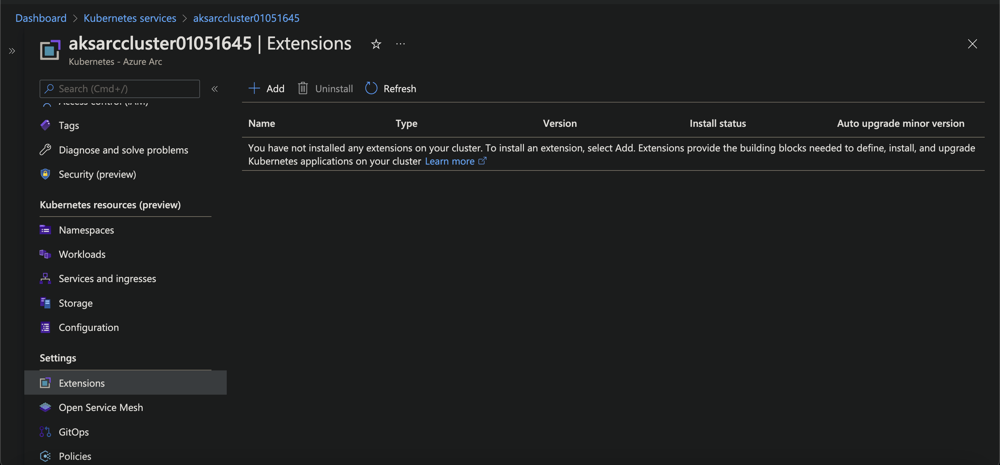

Select Add and follow the on-screen instructions. Following set of diagrams would show how the creation process works and finally deploys a Data controller extension onto Azure Arc-enabled AKS cluster

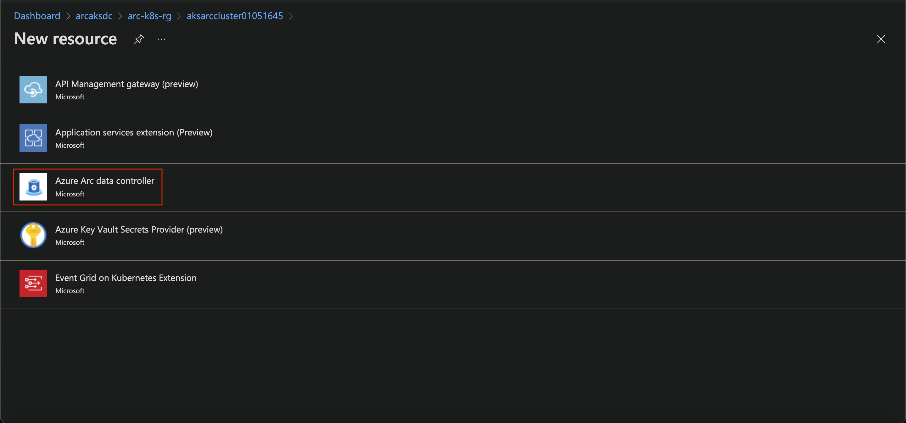


Select **Create** and fill up all the details to complete the create the Data Controller extension

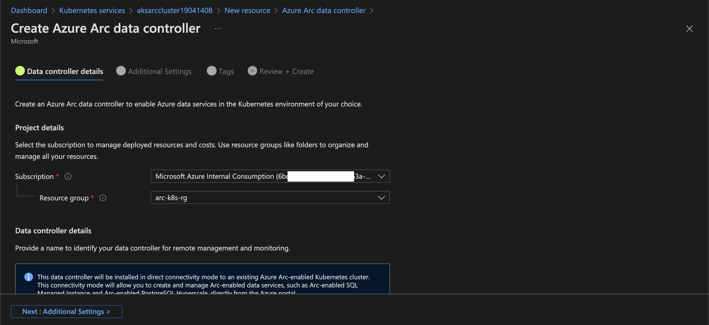

Provide a Name to the **Custom Location**

> [!NOTE]
>
> Azure Arc will create a namespace on AKS cluster with this which can be used to track the progress of subsequent deployments

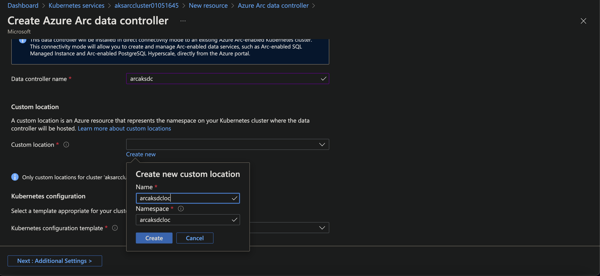

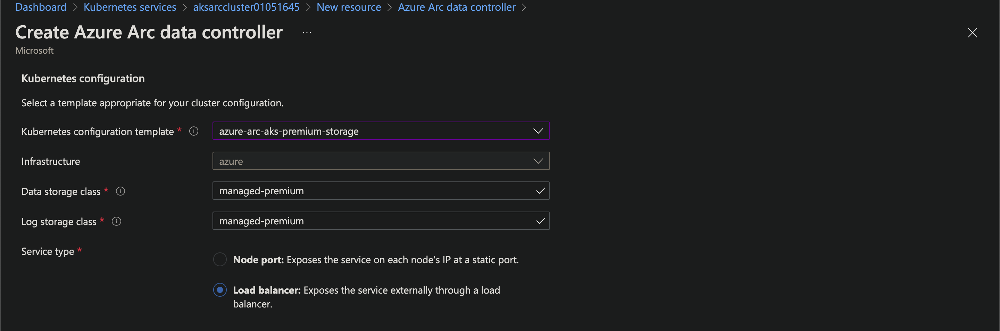

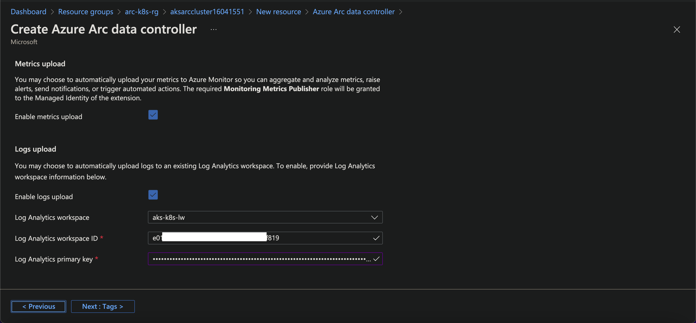

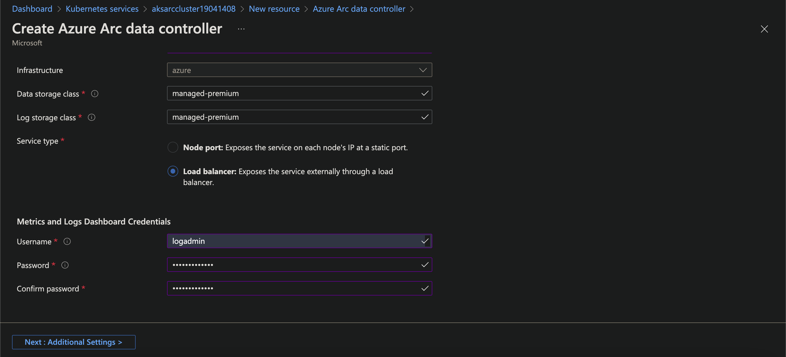

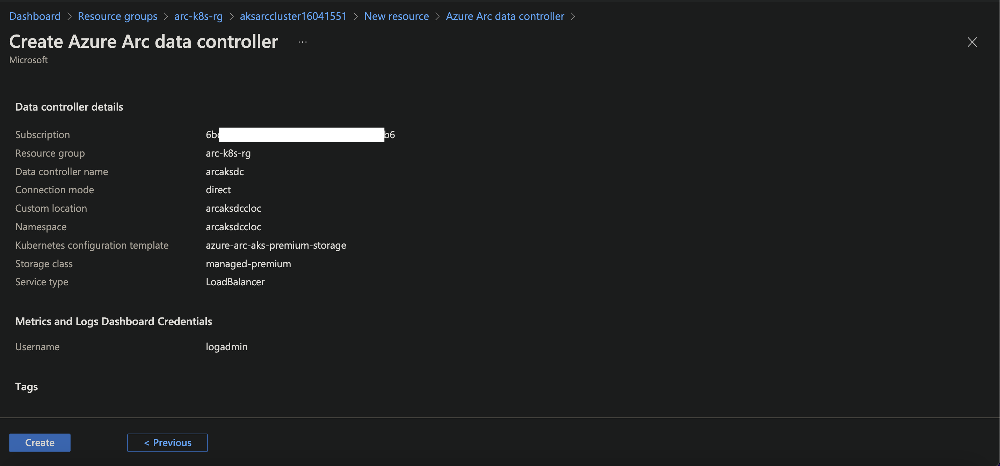

Select **Create** and look at he CLI to see the progress

```bash
kubectl get datacontrollers -A -w
```

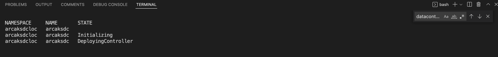

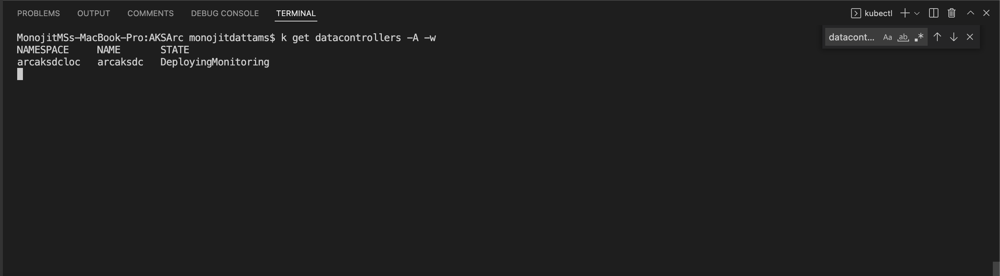

Wait for the status to **Ready**. At this stage entire Data Controller setup is complete and we are ready to move further

### Deploy SQL Managed Instances

Since now our Data Controller extension is ready on Azure Arc-enabled Kubernetes; we will now go-ahead and deploy SQL Managed Instance onto this.

As we have done for Data Controller extension, we will do the SQL MI deployment through portal and check the status in Azure CLI. Following figures should explain the steps

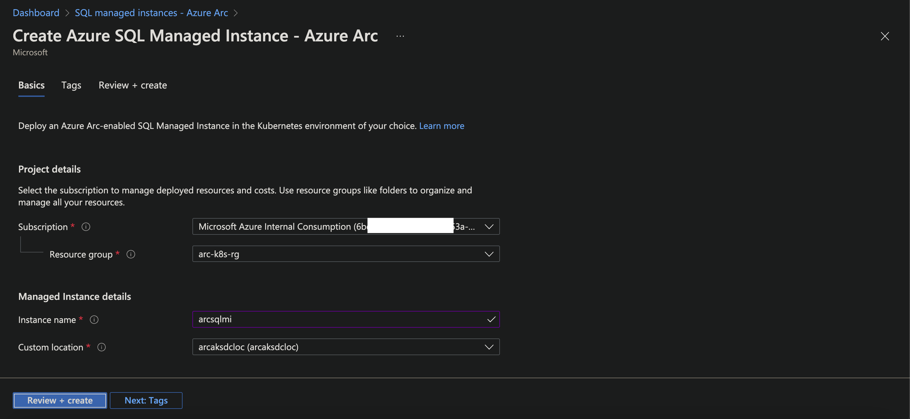

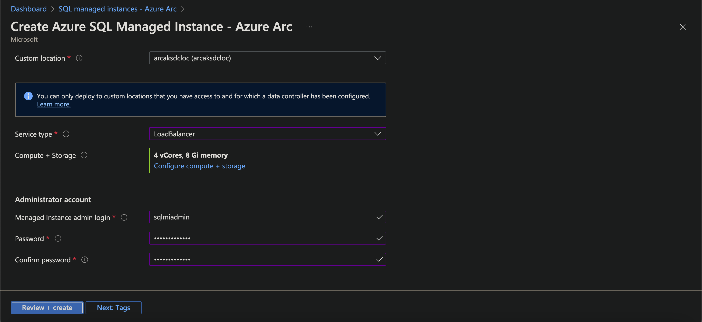

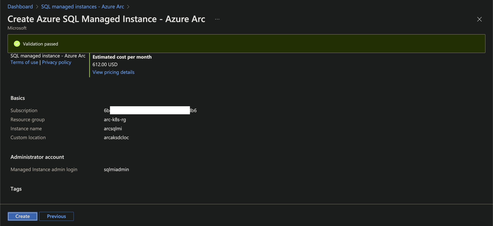

Select **Create** and deploy SQL MI containers onto the AKS cluster. Check the status of the progress in the Azure CLI

```bash
kubectl get pods -n arcaksdccloc -w
```

> [!NOTE]
>
> **arcaksdccloc** is the name of the **Custom Location** chosen earlier. It can be any name of our choice; change the command accordingly
>
> kubectl get pods -n **<Custom Location Name>** -w

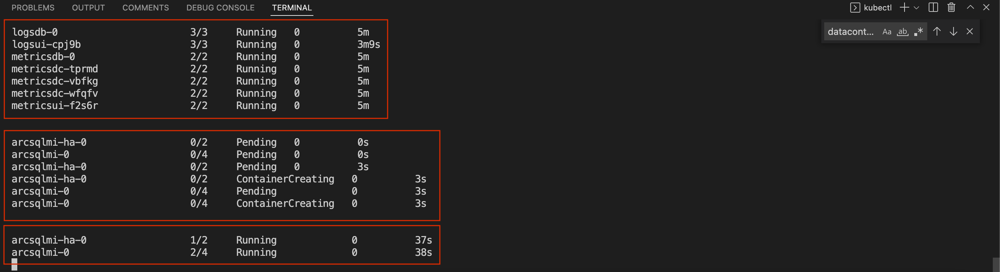

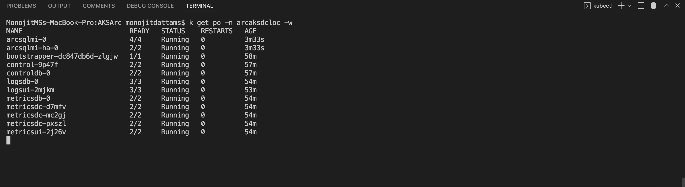


At this stage, SQL MI is deployed onto AKS cluster through Arc-enabled Data Controller and we are all set to move ahead with this 
