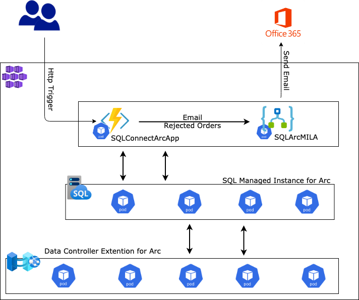
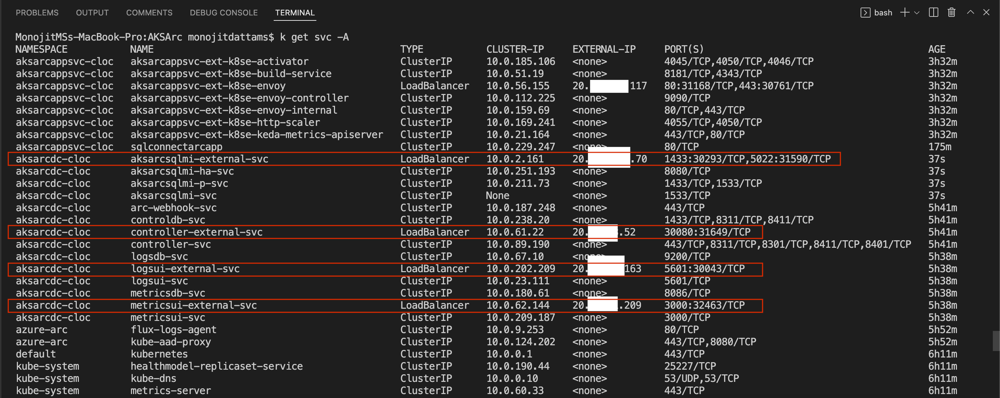
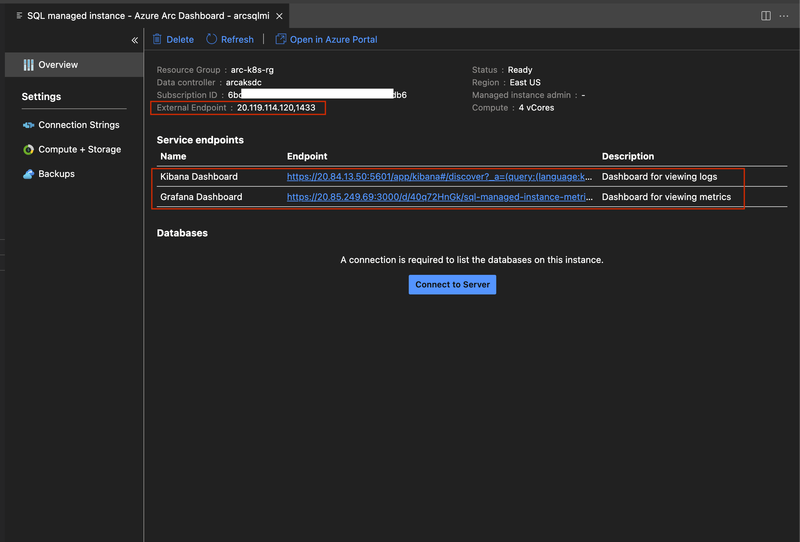
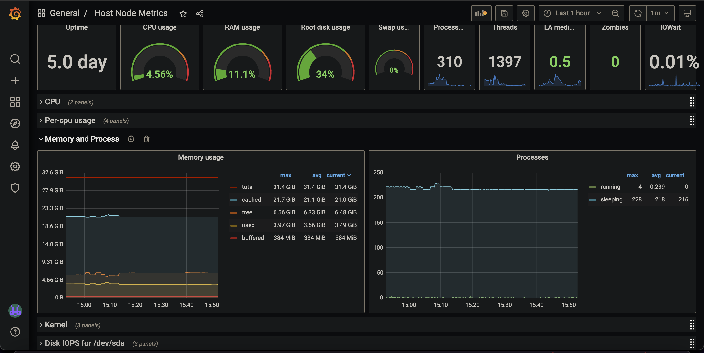

# Connected Micro-services with Azure Arc using Kubernetes and SQL Managed Instance

## Introduction

Azure Arc provides a simplified *Governance* and *Management* capability by delivering a consistent multi-cloud and on-premises management platform. Azure Arc-enabled Kubernetes allows us to on-board and manage Kubernetes clusters running anywhere -  clusters running on other public cloud providers (*GCP* or *AWS*) or clusters running on on-premise data-centers (*VMware vSphere* or *Azure Stack HCI*) to Azure Arc. Azure Arc-enabled data services allows us to run Azure data services like *SQL Managed Instance* or *PostgreSQL Hyperscale (preview)* anywhere using Kubernetes.

## What are we going to build?



In this article we will build an end-to-end flow of a connected set of simple micro-services and an SQL Managed Instance all deployed on an AKS cluster. The same example can be extended to deploy all the components onto any other cluster of choice - GKE, EKS or even on any un-managed cluster.

Following are the components to be deployed:

- **An Azure Function App** - This implemented the core business logic of Add, Update or Fetch from SQL MI database
- **A Logic App** - This implements the notification flow by sending emails to intended recipients and is triggered by the Function App
- **An SQL MI** - This holds the business data needed for the entire flow and can be accessed only from the above applications running within the cluster

All the above components will be running Privately within the AKS cluster and is exposed only through an Ingress Controller. This article would deploy this Ingress Controller as a *Public Load Balancer* for simplicity; but a more stringent and recommended approach would be make this Ingress Controller as an *Internal Load Balancer* with private IP and expose it only through an Application Gateway or API Management resource, thus making the InBound access more secure.

## Steps to build this

Following are the steps we would follow as we move on:

- Create a basic AKS Cluster. For simplicity, we would not add any additional security or features in this cluster
- **On-board** the cluster onto Azure Arc
- Deploy **Data Controller extension** for Arc
- Deploy **SQL MI** on Azure Arc
  - Connect and review the deployments
- Connect Data services running inside the cluster using the **Azure Data Studio**
- Deploy an **Azure Function App** as Container onto the AKS cluster
- Deploy **Logic App** as container onto the AKS cluster
- Deploy an **Ingress Controller** to provide access to the application and data services running inside the cluster - we would be using **Nginx** here and configure it as a Public Load Balancer
- Deploy **Ingress routing** within the cluster
  - Application Ingress
  - Data Monitor Ingress
- Test the Application flow end-to-end using **Postman**

## Let us delve into this

### Prerequisites

- An active Azure Subscription
- A Github account (optional)
- [kubectl](https://kubernetes.io/docs/tasks/tools/)
- [Azure CLI](https://docs.microsoft.com/en-us/cli/azure/install-azure-cli)
- [Azure Data Studio](https://docs.microsoft.com/en-us/sql/azure-data-studio/download-azure-data-studio?view=sql-server-ver15) (*Optional*)
  - Although optional, this is an important tool connect with SQL MI on cluster and then manage the databases
  - Follow these [Instructions](https://docs.microsoft.com/en-us/azure/azure-arc/data/install-client-tools) to install all necessary components
- [Visual Studio Code](https://code.visualstudio.com/download) (*Optional*) or any other preferred IDE

### Prepare Environment

Let us prepare the environment first even before creating the AKS cluster

- Set **CLI** variables
- Create **Service principals**
- Create **Virtual Networks**
- Create **Azure Container Registry**
- Create **Azure KeyVault**

#### Set CLI Variables

```bash
tenantId="<tenantId>"
subscriptionId="<subscriptionId>"
arcResourceGroup="arc-k8s-rg"
aksResourceGroup="aks-k8s-rg"
arcsvcResourceGroup="arc-services-rg"
location="eastus"
clusterName="aks-k8s-cluster"
version=1.22.4
acrName=aksk8sacr
acrId=
aksVnetName=aks-k8s-vnet
aksVnetPrefix="<Address prefix of the Vent to host AKS cluster>"
aksVnetId="<To be set later>"
aksSubnetName=aks-k8s-subnet
aksSubnetPrefix="<Address prefix of the Subnet to host AKS cluster>"
aksSubnetId="<To be set later>"
sysNodeSize="Standard_D8s_v3"
sysNodeCount=3
maxSysPods=30
networkPlugin=azure
networkPolicy=azure
sysNodePoolName=arcsyspool
vmSetType=VirtualMachineScaleSets
addons=monitoring
connectedClusterName="aksarccluster"
```

#### Login to Azure

```bash
az login --tenant $tenantId
```

#### Create Resource groups

```bash
# Resoure group for all Arc-enabled resources
az group create -n $arcResourceGroup -l $location
```

```bash
# Resoure group for all AKS cluster and related resources
az group create -n $aksResourceGroup -l $location
```

```bash
# Resoure group for all Application services
az group create -n $arcsvcResourceGroup -l $location
```

#### Create Virtual Network

```bash
az network vnet create -n $aksVnetName -g $aksResourceGroup --address-prefixes $aksVnetPrefix
aksVnetId=$(az network vnet show -n $aksVnetName -g $aksResourceGroup --query="id" -o tsv)
echo $aksVnetId
```

#### Create Subnet to host the AKS cluster

```bash
az network vnet subnet create -n $aksSubnetName --vnet-name $aksVnetName -g $aksResourceGroup --address-prefixes $aksSubnetPrefix
aksSubnetId=$(az network vnet subnet show -n $aksSubnetName --vnet-name $aksVnetName -g $aksResourceGroup --query="id" -o tsv)
echo $aksSubnetId
```

#### Create Service Principals

> [!NOTE]
>
> - This is the legacy approach and should ideally be avoided for the Managed Identity approach, which is recommended
> - If we go with this approach (*i.e. Service Principal*) then we have to perform role assignment on various resources and we should do it even before creating the cluster
> - If we go with the Managed Identity approach, then majority of the role assignments are taken care of by AKS cluster creation script. Only thing we need to do additionally is to provide a *Monitoring Metrics Publisher* role to the Managed Identity attached to the AKS cluster. This should be done post the cluster creation

```bash
az ad sp create-for-rbac --skip-assignment -n arc-aks-sp
{
  "appId": "",
  "displayName": "arc-aks-sp",
  "name": "",
  "password": "",
  "tenant": ""
}
```

> [!NOTE]
>
> Note down the **appId** and **password** fields which we would be need ing it later. Let us call them as *spAppId*, *spPassword*

```bash
# Role assignment - Network Contributor to VNET
az role assignment create --assignee $spAppId --role "Network Contributor" --scope $aksVnetId

# Role assignment - Monitoring Metrics Publisher to the Resource group hosing the Arc-enabled services
arcResourceGroupId=$(az group show -n $arcResourceGroup --query="id" -o tsv)
az role assignment create --assignee $spAppId --role "Monitoring Metrics Publisher" --scope $arcResourceGroupId
echo $arcResourceGroupId
```

#### Create Azure Container Registry

> [!NOTE]
>
> This is needed to store container images of the applications to be deployed onto AKS cluster securely

```bash
# Create ACR
az acr create -n $acrName -g $aksResourceGroup --sku STANDARD --admin-enabled false
acrId=$(az acr show -n $acrName -g $arcsvcResourceGroup --query="id" -o tsv)
echo $acrId

# Role assignment - AcrPull to ACR
az role assignment create --assignee $spAppId --role "AcrPull" --scope $acrId
```

#### Create Azure KeyVault

> [!NOTE]
>
> We will store all application specific secrets into this KeyVault and configure both Function App and Logic App to read from it

Create KeyVault from [Portal](https://docs.microsoft.com/en-us/azure/key-vault/general/quick-create-portal) or [Azure CLI](https://docs.microsoft.com/en-us/azure/key-vault/general/quick-create-cli)

#### Create AKS Cluster

- We can create it using [Portal](https://docs.microsoft.com/en-us/azure/aks/learn/quick-kubernetes-deploy-portal) or [Azure CLI](https://docs.microsoft.com/en-us/cli/azure/aks?view=azure-cli-latest#az-aks-create)
- We will be taking the CLI approach

```bash
az aks create --name $clusterName \
--resource-group $aksResourceGroup \
--kubernetes-version $version --location $location \
--vnet-subnet-id "$aksSubnetId" --enable-addons $addons \
--node-vm-size $sysNodeSize \
--node-count $sysNodeCount --max-pods $maxSysPods \
--service-principal $spAppId \
--client-secret $spPassword \
--network-plugin $networkPlugin --network-policy $networkPolicy \
--nodepool-name $sysNodePoolName --vm-set-type $vmSetType \
--generate-ssh-keys \
--disable-rbac \
--attach-acr $acrName
```

#### Connect to the AKS cluster

```bash
az aks get-credentials -g $aksResourceGroup --name $clusterName --admin --overwrite
```

> [!TIP]
>
> - This command also configures the .kubeconfig on local machine
> - All subsequent commands for Azure Arc will take effect on this K8s cluster only

So we have now created a basic AKS cluster which will be hosting our Applications (*Azure Function* and *Logic App*) and SQL MI Database instance and help us to build an end-to-end use case.

### On-board AKS cluster on Azure Arc

```bash
# Add Azure Arc extension for Azure CLI
az extension add --name connectedk8s

# Register following providers
az provider register --namespace Microsoft.Kubernetes
az provider register --namespace Microsoft.KubernetesConfiguration
az provider register --namespace Microsoft.ExtendedLocation
```

```bash
# on-board AKS cluster onto Azure Arc
az connectedk8s connect -g $arcResourceGroup -n $connectedClusterName
```

> [!TIP]
>
> - This takes sometime to complete
> - The progress status can be checked in the Portal or from the Azure CLI

```bash
# Show the progress
az connectedk8s show -g $arcResourceGroup -n $connectedClusterName
```

> [!TIP]
>
> Wait till status is *Connected* - this is when AKS cluster in fully on-boarded onto Azure Arc

The next task will be to Deploy the Data Controller Extension onto Azure Arc-enabled AKS cluster.

### Deploy Data Controller Extension


Select Add and follow the on-screen instructions. Following set of diagrams would show how the creation process works and finally deploys a Data controller extension onto Azure Arc-enabled AKS cluster.


Select **Create** and fill up all the details to complete the create the Data Controller extension.


Provide a Name to the **Custom Location**

> [!NOTE]
>
> Azure Arc will create a namespace on AKS cluster with this which can be used to track the progress of subsequent deployments.


#### Service Type

- **Load Balancer** - deploy data controller and monitoring services as Load Balancer with Public IP
- **NodePort** - deploy data controller and monitoring services as NodePort IP

> [!NOTE]
>
> - Creating it as a **Load Balancer** would allow us to access the Monitoring services - **Grafana** and **Kibana** publicly - browser or through tools like Azure Data Studio
>
> - Creating it as **NodePort** will make the access restrictive and prevent us from accessing it Publicly.
>
>   We then have to depend on *kubectl* commands or bringing in an **Ingress Controller** in front of these services and allow access.
>
>   In this article, we will follow the 2nd approach and make the entire Inbound flow secured


Select **Create** and look at he CLI to see the progress

```bash
kubectl get datacontrollers -A -w
```


Wait for the status to **Ready**. At this stage entire Data Controller setup is complete and we are ready to move further.

### Deploy SQL Managed Instances

Since now our Data Controller extension is ready on Azure Arc-enabled Kubernetes; we will now go-ahead and deploy SQL Managed Instance onto this.

As we have done for Data Controller extension, we will do the SQL MI deployment through portal and check the status in Azure CLI. Following figures should explain the steps.


#### Service Type

- **Load Balancer** - deploy SQL MI service as Load Balancer with Public IP
- **NodePort** - deploy SQL MI service  as NodePort IP

> [!NOTE]
>
> - Creating it as a Load Balancer would allow us to access the SQL MI service publicly - through browser or through tools like Azure Data Studio
>
> - Creating it as NodePort will make the access restrictive and prevent us from accessing it Publicly.
>
>   We then have to depend on *kubectl* commands or bringing in an Ingress Controller in front of these services and allow access.
>
>   In this article, we will follow the 2nd approach and make the entire Inbound flow secured


Select **Create** and deploy SQL MI containers onto the AKS cluster. Check the status of the progress in the Azure CLI.

```bash
kubectl get pods -n arcaksdccloc -w
```

> [!NOTE]
>
> **arcaksdccloc** is the name of the **Custom Location** chosen earlier. It can be any name of our choice; change the command accordingly - *kubectl get pods -n **<Custom Location Name>** -w*


At this stage, SQL MI is deployed onto AKS cluster through Arc-enabled Data Controller and we are all set to move ahead with this.

As we can see that there are multiple services which are exposed with a Public IP and can be accessed from anywhere:

- aksarcsqlmi-external-svc - **SQL MI** service (Port **1433**)
- controller-external-svc - **Data Controller** service
- logsui-external-svc - **Kibana dashboard** service (Port **5601**)
- metricsui-external-svc - **Grafana dashboard** service (Port **3000**)

#### Service Type

##### Load Balancer



##### NodePort


### Connect through Data Studio

Let us now try to connect the SQL MI database through Azure Data Studio and view/manage its contents.

#### Service Type

##### Load Balancer

Since the Data Controller is exposed as a Load Balancer service with a public IP, we can connect to the directly and view/manage its contents.

##### Tables


##### Monitoring



##### NodePort

Since the Data Controller is exposed as a NodePort service, so we can not connect to the Database from Data Studio; but we can see the metadata information for the same.

- External endpoint to access the server is private; hence **Connect to Server** from *Data Studio* would fail. We will reach out to the database from within the cluster later
- **Kibana** and **Grafana** endpoints will be accessed from within the cluster through a Load Balancer service
- *We will come back to this again once we complete the deployment of the application stack*


### Connect through Azure CLI

#### Connect to Data Controller Pod

```bash
# aksarcdccloc is the namespace where all data controller resources have been deployed
kubectl get po -n aksarcdccloc
```

- **controldb-0** - Data Controller Pod
- **arcsqlmi-0** - SQL MI Pod


- **arcsqlmi-external-svc** - SQL Server service
- **controller-external-svc** - Controller service
- **logsui-external-svc** - Kibana service
- **metricsui-external-svc** - Grafana service


```bash
# Connect to the controldb-0 pod
kubectl exec -it controldb-0 -n aksarcdccloc -c mssql-server -- bash
```

Run following set of commands to setup the Database (**Orders**) and the corresponding Tables (**Products**, **Returns**)

```sql
# Connect to the sql server
# Server or Host name - arcsqlmi-external-svc.<namespace>.svc, <port number>
# UserName - that we had provided while creating the SQL Mi instance throigh portal
# password - that we had provided while creating the SQL Mi instance throigh portal
./opt/mssql-tools/bin/sqlcmd -S arcsqlmi-external-svc.aksarcdccloc.svc,1433 -U <UserName> -P <Password>

CREATE DATABASE Orders
GO

CREATE TABLE dbo.Products (ProductID nvarchar(50) PRIMARY KEY NOT NULL, ProductName varchar(25) NOT NULL, Price money NULL, Quantity float, ProductDescription varchar(max) NULL)
GO

CREATE TABLE dbo.Returns (ProductID nvarchar(50) PRIMARY KEY NOT NULL, ProductName varchar(25) NOT NULL, Quantity float, Reason varchar(max) NULL)
GO
```


### Applications

- Clone the [Repository](https://github.com/monojit18/AKS-Arc)

- Create a **Storage Account** from the Azure Portal for Function app and Logic App to cache metadata and state

  > [!TIP]
  >
  > Note down the Storage Account credentials, **ConnectionString**, which will needed later.

#### SQLArcMILA

> [!NOTE]
>
> This Logic App is going to have a **Outlook.com** connection for sending emails. Any such API connections need a *Service Principal* to be created and given appropriate permission so that Logic App, running as a container (anywhere).

- Please follow this [Blog](https://techcommunity.microsoft.com/t5/integrations-on-azure-blog/run-logic-app-anywhere/ba-p/3118351) link for details on how to deploy Logic app as container

- Create a **Service Principal** by any standard means - Portal or CLI; note down the **appId** and **password** values. Let us call it **aks-arc-la-sp** for our easy reference later

- Open the project in *Visual Studio Code*

- Go to **LogicApps/SQLArcMILA**

- Open **local.settings.tmpl.json**

  - Rename the file to **local.settings.json**
  - **AzureWebJobsStorage** - Replace it by the Storage Account connection string
  - **WORKFLOWS_TENANT_ID** - **TenantId** of the sub scripting being used
  - **WORKFLOWS_SUBSCRIPTION_ID** - **SubscriptionId** being used
  - **WORKFLOWS_RESOURCE_GROUP_NAME** - **Resource Group** for the Logic App
  - **WORKFLOWS_LOCATION_NAME** - **Location** of the Logic App
  - **WORKFLOWS_MANAGEMENT_BASE_URI** - https://management.azure.com/
  - **WORKFLOWAPP_AAD_TENANTID** - **TenantId** of the sub scripting being used
  - **WORKFLOWAPP_AAD_CLIENTID** - **appId** of the Service Principal
  - **WORKFLOWAPP_AAD_CLIENTSECRET** - **password** of the Service Principal
  - **WORKFLOWAPP_AAD_OBJECTID** - **ObjectId** of the user in Azure AD
  - **outlook-connectionKey** - *This will be assigned by the Logic App designer when we establish the **Outlook.com** connection*

- Open the LogicApps/SQLArcMILA/sqlmiflow/workflow.json file in Logic App Designer from within VS Code

  

- The *Connection* object will be shown as an error as we need to reconfigure the connection here. Follow the On-screen instructions and complete the connection

- Once done, there will be **connection.json** file created within the workspace with the details of Outlook.com connection

- An API Connection will be created in the Azure portal; add the above service principal - **aks-arc-la-sp** in the *Access Policies* section

  

- Review **connections.json**

  ```json
  {
    "managedApiConnections": {
      "outlook": {
        "api": {
          "id": "/subscriptions/<subscriptionId>/providers/Microsoft.Web/locations/eastus/managedApis/outlook"
        },
        "connection": {
          "id": "/subscriptions/<subscriptionId>/resourceGroups/arc-services-rg/providers/Microsoft.Web/connections/outlook"
        },
        "connectionRuntimeUrl": "https://<xxx>.common.logic-eastus.azure-apihub.net/apim/outlook/<yyy>/",
        "authentication": {
          "type": "Raw",
          "scheme": "Key",
          "parameter": "@appsetting('outlook-connectionKey')"
        }
      }
    }
  }
  ```

- Review **local.settings.json** file and look for **outlook-connectionKey** value

  ```json
  "outlook-connectionKey": "eyJ0eXAiOiJKV1QiLCJhbGciOi..........DPm0j1LWJ1FmgptA"
  ```

- We are now all set build and deploy this Logic App Locally

  ```bash
  # Build docker image
  docker build -t $acrName/<image_name>:<tag> .
  
  # Create logic app as Container and Run locally
  docker run --name sqlarcmila -e AzureWebJobsStorage=$azureWebJobsStorage -e WORKFLOWAPP_AAD_TENANTID=<value> -e WORKFLOWAPP_AAD_CLIENTID=<value> -e WORKFLOWAPP_AAD_OBJECTID=<value> -r WORKFLOWAPP_AAD_CLIENTSECRET=<value> -d -p 8080:80 $acrName/<image_name>:<tag>
  ```

- Once the docker container is created locally, go to the Storage account in Azure  portal

  

  

  > [!TIP]
  >
  > Now down this **master key**. This will be used by local Logic App docker container to call Logic App Apis internally. Please note, since we are not using the Azure portal and its designer, it is our responsibility to call Logic App Apis internally, to get the metadata information e.g. the Post Url of the Http triggered Logic App.

- At this point we are all set to test the Logic App locally from any rest client like *Postman*

  ```bash
  # Get the POST url for the Logic App
  curl -X POST http://localhost:8080/runtime/webhooks/workflow/api/management/workflows/sqlmiflow/triggers/manual/listCallbackUrl?api-version=2020-05-01-preview&code=<master key>
  
  # Response
  {
      "value": "https://localhost:443/api/sqlmiflow/triggers/manual/invoke?api-version=2020-05-01-preview&sp=%2Ftriggers%2Fmanual%2Frun&sv=1.0&sig=<signature>",
      "method": "POST",
      "basePath": "https://localhost/api/sqlmiflow/triggers/manual/invoke",
      "queries": {
          "api-version": "2020-05-01-preview",
          "sp": "/triggers/manual/run",
          "sv": "1.0",
          "sig": "<signature>"
      }
  }
  
  # Use the Signature value to form the POST url for the Logic App and call it
  curl -X POST http://localhost:8080/api/sqlmiflow/triggers/manual/invoke?api-version=2020-05-01-preview&sp=%2Ftriggers%2Fmanual%2Frun&sv=1.0&sig=Spk4kvmvXDgfyTxXREVm8SgvIH_LK49aECRZn8NkPCk --data '{"id": "56C394F1-7448-4D28-B44D-1CB6A4579646", "name": "local22", "quantity": 300, "reason": "high"}'
  ```

- If everything is ok then we should get an Email. Let us now build and push this Logic app image to **Azure Container Registry**

  ```bash
  az acr build -t <acrName>.azurecr.io/sqlconnectarcapp:v1.0.0 -r <acrName> .
  ```

#### SqlConnectArcApp

- An Azure Function App which is http triggered and accepts an Order for a Product
- If the requested quantity of the **Orders** is *more than an upper bound*, say, 100 it Rejects the Order and send this to the **Returns** Table
- Similarly, if the requested quantity of the Order is *less than an lower bound*, say, 10 it Rejects the Order and send this to the **Returns** Table
- Everything else goes to **Products** Table
- Finally the Rejection information is sent, with the reason for rejection, through a Logic App that sends an email to to the intended recipients

##### Deploy Function App

- Go to **ServerlessApps/SqlConnectArcApp/SqlConnectArcApp** folder

- Open **local.settings.tmpl.json**

  - Rename the file to **local.settings.json**
  - **SQLConnectionString** - Replace **UserName** and **Password** with appropriate values as set before
  - **LOGICAPP_CALLBACK_URL** - Replace **Code** by the mastery from Azure Storage as explained in the Logic App deployment section
  - **LOGICAPP_POST_URL** - Nothing to be changed here; this will be set appropriately by the function app itself

- Build the Function App and Push to Azure Container Registry

  ```bash
  az acr build -t <acrName>.azurecr.io/sqlconnectarcapp:v1.0.0 -r <acrName> .
  ```

#### Deploy Applications onto AKS cluster

We will now configure the AKS cluster and deploy few additional resources to make the deployment work seamlessly for both Function App and Logic App and thus for the entire end-to-end flow.

> [!TIP]
>
> - We will need the Service Principal created earlier while creating AKS cluster viz. **$spAppId**, **$spPassword** and keep them handy. We will need this in the following steps here
> - Provide Get and List access to they Service Principal for the **Keys**, **Secrets** and **Certificates**
> - CSI driver will use this Service Principal to access KeyVault and fetch the secret values

##### Add Secrets to KeyVault

Add following Secrets to the KeyVault from Azure Portal; these Secrets are used across Function App and Logic App. All these information are already available from the above discussions:

- **AzureWebJobsStorage**
- **SQLConnectionString**
- **LOGICAPP-CALLBACK-URL**
- **LOGICAPP-POST-URL**
- **WORKFLOWAPP-AAD-CLIENTID**
- **WORKFLOWAPP-AAD-CLIENTSECRET**
- **WORKFLOWAPP-AAD-OBJECTID**
- **WORKFLOWAPP-AAD-TENANTID**
- **outlook-connectionKey**

##### Deploy Applications

```bash
# Create a namespace for APIs - this will host both Function App and Logic App
kubectl create ns apis

# Go to Deployment folder
cd Deployments

# Create Secret to store the Servive principal with thin the AKS cluster; to be used by CSI KeyVault provider
kubectl create secret generic secrets-store-creds --from-literal clientid=$spAppId --from-literal clientsecret=$spPassword -n apis
kubectl label secret secrets-store-creds secrets-store.csi.k8s.io/used=true -n apis

# Deploy CSI driver for KeyVault
kubectl apply -f ./secret-provider.yaml

# Deploy Logic App - SQLArcMILA
kubectl apply -f ./sqlarcmila.yaml

# Deploy Azure Function App - SQLConnectArcApp
kubectl apply -f ./sqlconnectarcapp.yaml
```

> [!NOTE]
>
> Although we have deployed all applications and services onto the AKS cluster, the major services for Data Controller extension are all **NodePort** and services for the applications are all **Cluster IP**; hence we would need an **Ingress Controller** which will be public facing Load Balancer and with a **Public IP**. This Ingress Controller along with **K8s Ingress** routing will send traffic to appropriate backend services - for *Application services* as well as for *Data Controller extension services*.

#### Deploy Nginx Ingress Controller

```bash
# Install Nginx Ingress Controller
helm repo add ingress-nginx https://kubernetes.github.io/ingress-nginx
helm repo update

kubectl create ns arc-nginx-ingess-ns
helm install arc-nginx-ingess ingress-nginx/ingress-nginx --namespace arc-nginx-ingess-ns \
--set controller.replicaCount=2 \
--set controller.nodeSelector.agentpool=arcsyspool \
--set controller.defaultBackend.nodeSelector.agentpool=arcsyspool

# Post Installation - check the Public IP
kubectl get svc -n arc-nginx-ingess-ns -w
```

> [!TIP]
>
> - Note down the **Public IP** as we will need this later
> - This can be added as an **A-record** in DNS server to make it better accessible

#### Deploy K8s Ingress

We will need two Ingress objects - one for Application services and one for Data Controller Extension services as they are deployed onto two different namespaces.

> [!NOTE]
>
> - Ingress can be configured to support TLS by passing the Certificate information of the DNS server
> - Ingress can be configured to support **SSL Offloading** at the Ingress Or sending to the backend as **Https**

> [!TIP]
>
> - Replace <dns-name> by the name of the DNS server
> - Create a k8s **Secret** of type **tls** within AKS cluster with the certificate information of the DNS server. The PEM certificate file as **--cert** and the Private key of the certificate as **--key** to be passed while creating the k8s Secret

```bash
# Go to Deployment folder
cd Deployments

# Deploy Ingress object for Data Controller Extension services 
kubectl apply -f ./arc-aks-ingress.yaml

# Deploy Ingress object for Application services 
kubectl apply -f ./arc-aks-apis-ingress.yaml
```

### Test the Application flow

Let us now test the application flow end-to-end.

#### Add Products

```bash
# Quantity > 10 and < 500 so will go to Products
curl -X POST https://<dns-name>/sql/api/orders --data '{"name": "Civic23", "price": 1300.00, "desc": "Car", "quantity": 200}'
```

#### Add Returns

```bash
# Quantity < 10, too low, so will go to Returns
curl -X POST https://<dns-name>/sql/api/orders --data '{"name": "Ciaz", "price": 800.00, "desc": "Car", "quantity": 8}'
```

#### Get Products

```bash
curl https://<dns-name>/sql/api/orders/products
```

#### Get Returns

```bash
curl https://<dns-name>/sql/api/orders/returns
```

#### Metrics

> [!TIP]
>
> An A-record has to be created with the Public IP of the Nginx Ingress Controller pointing to grafanaarc.<dns-name>.

```bash
# In a browser type
https://grafanaarc.<dns-name>
```





#### Logs

> [!TIP]
>
> An A-record has to be created with the Public IP of the Nginx Ingress Controller pointing to kibanaarc.<dns-name>.

```bash
# In a browser type
https://kibanaarc.<dns-name>/app/kibana#/discover?_a=(query:(language:kuery,query:'custom_resource_name:arcsqlmi'))
```


### Conclusion

This end to end application flow depicts how multiple event driven applications - two n this case, an Azure function app and a Logic App - can talk to each other seamlessly, **run anywhere** and can **maintain state anywhere** - using SQL Managed Instance as Containers and leveraging *Azure Arc-enabled k8s* and *Azure Arc-enabled Data Services*. This represents a cost effective, flexible, resilient way of running Cloud Native Apps on variety platforms - **On-Premise**, **Edge** or **Cloud**.

## References

- [Source Code](https://github.com/monojit18/AKS-Arc) at Github
- [Azure Arc-enabled data services](https://docs.microsoft.com/en-us/azure/azure-arc/data/overview)
- [Azure Arc-enabled Kubernetes](https://docs.microsoft.com/en-us/azure/azure-arc/kubernetes/overview)
- [SQL managed instance on Azure Arc](https://docs.microsoft.com/en-us/azure/azure-arc/data/create-sql-managed-instance?tabs=indirectly)
- [Run Logic App Anywhere](https://techcommunity.microsoft.com/t5/integrations-on-azure-blog/run-logic-app-anywhere/ba-p/3118351)

