# Seamlessly Deploy Cloud Native Apps - using Azure Arc and AKS


## Introduction

The purpose of this document is to guide users to *Deploy* various *Cloud Native Applications* seamlessly onto an <u>*AKS cluster*</u> without explicitly containerizeing them!  This also implied that now developers/archietcts coming from various domian and technology background, do not necessarily need to know te nitti-gritties of the *Containers* per seh for deploying their applications; but still can get the benefits of Kubernetes based of eco-sytem, its scaling, flexibility of application lifecycle management and resiliency!

We would use *Azure Arc for Kubernetes* as the service. This would help us to still work with our applications as-is on Cloud *(App Services, Functions, Logic Apps, Message Brokers like EventGrid* etc.) yet you can run it anywhere - be it on a *Managed Cluster like AKS* or an *Un-managed cluster like [CAPZ](https://capz.sigs.k8s.io/))* Or *K8s clusters on any other Cloud* Or even *K8s bare metal clusters*.

This is in continuation to this [Article] where we had describe the same for deploying onto a *CAPZ* based Un-mnaged cluster

### What the Document does

- Deep-dive on Azure Arc for K8s
- Create a Managed cluster - *[AKS](https://docs.microsoft.com/en-us/azure/aks/)*
- Installs all Providers and Extensions needed by Azure Arc for K8s
- Creates and Deploys a Function App viz. *Perform Zip* built in .NetCore onto the AKS cluster
- Creates and Deploys a Logic App workflow viz. *NotifyZipLA* onto the AKS cluster
- Create an *EventGrid Topic* on Azure and Subscribes for any of the above services e.g. *NotifyZipLA* endpoint
  - Push an event to EventGrid topic
  - Check that the corresponding Logic App endpoint is fired!

### What the Document does NOT

- Deep-dive on AKS
- Deep-dive on [Azure Arc](https://docs.microsoft.com/en-us/azure/azure-arc/overview)
- Go thru the details of AKS cluster creation


[*Ref: Azure Arc Components*](https://docs.microsoft.com/en-us/azure/azure-arc/kubernetes/conceptual-agent-architecture#deploy-agents-to-your-cluster)

- K8s Cluster can be anywhere - On-Prem, Azure or any other cloud
- *Azure Arc enabled K8s Service* sits on Azure and can connect all these clusters as a single control plane
- *Azure Arc enabled agent* makes outbound calls to push metadata information to Azure through *Azure Arc enabled K8s Service*
- *Azure Arc enabled agent* pulls information on Agent upgrade information and Configuration from Azure through *Azure Arc enabled K8s Service*

### Pre-requisites, Assumptions

- Knowledge on Containers, Serverless Functions, Logic App - *L200+*
- Knowledge on K8s  - *L200+*
- Knowledge on VSCode; Deploying applications through VSCode - L200+
- Some knowledge on Azure tools & services viz. *Azure CLI, KeyVault, VNET* etc. would help

### Plan

- #### Seggregate the workload into 3 Resource Groups as per the usage

  - **aks-k8s-rg**

    - Contains all Infrastructure components and services of the AKS cluster
      - **AKS Cluster** - the cluster itself
      - **Virtual Network and Subnets** - Hosting AKS cluster *Worker* Nodes
      - **NSGs** - for Worker Subnets
      - **Key Vault** - for storing any application specific Secrewts
      - **Azure Container Registry (*ACR*)** - Hosting Container images for alol applications to be deploed onto AKS cluster
    
  - **arc-k8s-workshop-rg**

    - Contains Azure Arc components for K8s

      - ##### **Arc Connected Cluster** for the AKS cluster

        - Establishes a connectivity to API Server running on AKS Control Plane (*Master Node*) and ensures Arc is managing the k8s cluster on Azure

      - ##### **CustomLocation**

        - Acts as the Target location for deploying application and Data service instances on the k8s cluster. 
      
        - Each cluster would need one or more Custom Locations
      
        - Each **CustomLocation** can host multiple app and data instances
      
        - To be explained later in details
      
          
      
      - ##### App Service Kubernetes environment
      
        - Enables configuration common to apps in the custom location
      
        - This is required before any apps are deployed onto the cluster
      
          
    
  - **arc-services-rg**

    - Contains all microservices to be deployed onto K8s Cluster
      - **Zip Images**
        - **ZipImagesArcApp**
          - A function app to Zip images uploaded in a blob - viz. *bigimageblob*
          - The zipped images are then uploaded in another blob - viz. *zippedimageblob*
        - **NotifyZipArcLA**
          - Logic App to Read from the *zippedimageblob* Blob
          - Send notification email to intended recipients with the above zipped image as an attachment
        - **aks-k8s-arc-cluster-ext-eg-evg-topic**
          - Event Grid Topic which subscribes to the Logic App
          - Send zipped image names to the *NotifyZipArcLA* Logic App
          - This should be treated as a flow outside the main function flow i.e. any zippied images uploaded manually to the *zippedimageblob* Blob should also be sent as a notification email to the recipients
      - **Validate OCR Images**
        - **ValidateOCRArcApp**
          - A function app to validate number plate images uploaded to a blob - viz. *ocrinfoblob*
          - The images are then sent to *Azure Cognitive Service* for a validation of the image - using [OCR](https://docs.microsoft.com/en-us/azure/cognitive-services/computer-vision/overview-ocr) API
          - The processed response is then placed in a queue - viz. *ocrinfoqueue*
        - **ProcessOCRImages**
          - A function app to process the OCR image response from the queue - *ocrinfoqueue*
          - If the images are reasily readable by OCR API then it is moved to another Blob viz, *approvedblob* 

### Action

#### Working Resources

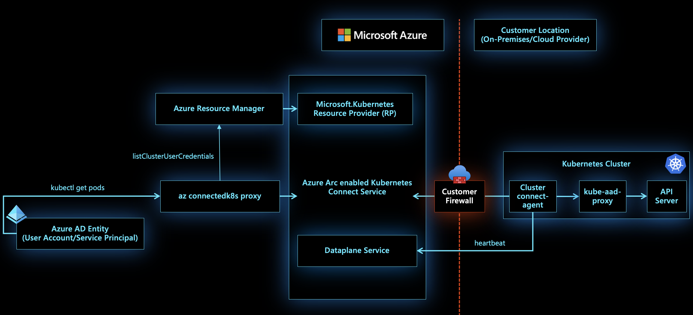

[Ref: Cluster Connect](https://docs.microsoft.com/en-us/azure/azure-arc/kubernetes/conceptual-cluster-connect#architecture)

- *cluster-connect* is a reverse-proxy agent running on the CAPZ cluster, established a session with *Azure Arc Service*
- Any call to K8s API server would be forwarded to *cluster-connect* agent which passes the request to *kube-aad-proxy*
- *kube-aad-proxy* reforms Azure AD authentication and if successful forwards the request to API Server for the intended cluster

1. **Set CLI** variables for easy usage and reference

   ```bash
   tenantId="<tenant_Id>"
   subscriptionId="<subscription_Id>"
   arcResourceGroup="arc-k8s-workshop-rg"
   aksResourceGroup="aks-k8s-rg"
   arcsvcResourceGroup="arc-services-rg"
   location="eastus"
   clusterName="aks-k8s-arc-cluster"
   version=<version>
   acrName=aksk8sacr
   acrId=
   aksVnetName=aks-k8s-vnet
   aksVnetPrefix=19.0.0.0/21
   aksVnetId=
   aksSubnetName=aks-k8s-subnet
   aksSubnetPrefix=19.0.0.0/24
   aksSubnetId=
   sysNodeSize="Standard_DS3_v2"
   sysNodeCount=3
   maxSysPods=30
   networkPlugin=azure
   networkPolicy=azure
   sysNodePoolName=arcsyspool
   vmSetType=VirtualMachineScaleSets
   addons=monitoring
   aadAdminGroupID=<aadAdminGroupID>
   aadTenantID==<aadTenantID?
   extensionName="$clusterName-ext-appsvc"
   extensionNamespace="$extensionName-ns"
   customLocationName="$clusterName-custom-location"
   connectedClusterName="arc-k8s-aks"
   ```

2. **Login** to Azure

   ```bash
   az login --tenant $tenantId
   ```

3. **Create** *Resource Groups* as described in the **Plan** section

   ```bash
   az group create -l eastus -n $aksResourceGroup
   az group create -l eastus -n $arcResourceGroup
   az group create -l eastus -n $arcsvcResourceGroup
   ```
   
5. **Create** Service Principal for CAPZ cluster

   - **k8s-capz-sp** - Name of the service principal

     ```bash
     # Create service principal - aks-k8s-sp
     az ad sp create-for-rbac --skip-assignment -n https://aks-k8s-sp
     
     # Service Principal details
     {
       "appId": "<appId>",
       "displayName": "https://aks-k8s-sp",
       "name": "<name>",
       "password": "<password>",
       "tenant": "<tenantId>"
     }
     ```

6. Set **Service Principal** credentials as CLI variables

   ```bash
   spAppId="<spAppId>"
   spPassword="<spPassword>"
   ```
   
6. Create Virtual Network and corresponding Subnet hosting the AKS cluster

   ```bash
   az network vnet create -n $aksVnetName -g $aksResourceGroup --address-prefixes $aksVnetPrefix
   aksVnetId=$(az network vnet show -n $aksVnetName -g $aksResourceGroup --query="id" -o tsv)
   echo $aksVnetId
   
   az network vnet subnet create -n $aksSubnetName --vnet-name $aksVnetName -g $aksResourceGroup --address-prefixes $aksSubnetPrefix
   
   aksSubnetId=$(az network vnet subnet show -n $aksSubnetName --vnet-name $aksVnetName -g $aksResourceGroup --query="id" -o tsv)
   echo $aksSubnetId
   ```
   
7. **Assign** *Role* for Service Principal

   - **Contributor** access to the Subscription

     ```bash
     # Create Role assignment - Contrubutor
     az role assignment create --assignee $spAppId --role "Contributor" --scope "/subscriptions/$subscriptionId"
     ```
     
   - **Network Contributor** access to the Virtual Network viz. 

     ```bash
     az role assignment create --assignee $spAppId --role "Network Contributor" --scope $aksVnetId
     ```
     
   - **Monitoring Metrics Publisher** access to the Resource Group for Arc resources viz. *$arcResourceGroup*

     ```bash
     arcResourceGroupId=$(az group show -n $arcResourceGroup --query="id" -o tsv)
     az role assignment create --assignee $spAppId --role "Monitoring Metrics Publisher" --scope $arcResourceGroupId
     ```

8. Create AKS Cluster

   ```bash
   az aks create --name $clusterName \
   --resource-group $aksResourceGroup \
   --kubernetes-version $version --location $location \
   --vnet-subnet-id "$aksSubnetId" --enable-addons $addons \
   --node-vm-size $sysNodeSize \
   --node-count $sysNodeCount --max-pods $maxSysPods \
   --service-principal $spAppId \
   --client-secret $spPassword \
   --network-plugin $networkPlugin --network-policy $networkPolicy \
   --nodepool-name $sysNodePoolName --vm-set-type $vmSetType \
   --generate-ssh-keys \
   --enable-aad \
   --aad-admin-group-object-ids $aadAdminGroupID \
   --aad-tenant-id $aadTenantID \
   --attach-acr $acrName
   ```

11. Connect to the Cluster

    ```bash
    az aks get-credentials -g $aksResourceGroup --name $clusterName --admin --overwrite
    ```
    
13. **Set** *Azure Arc Extension* variables

    ```bash
    connectedClusterName="arc-capz-k8s"
    customLocationName="$clusterName-custom-location"
    appsvcExtensionName="$clusterName-ext-appsvc"
    appsvcExtensionNamespace="$clusterName-appsvc-ns"
    appsvcKubeEnvironmentName="$clusterName-appsvc-kube"
    ```

11. Add **connectedk8s** extension to Azure CLI

    ```bash
    az extension add --upgrade --yes --name connectedk8s
    az extension add --upgrade --yes --name k8s-extension
    az extension add --upgrade --yes --name customlocation
    az extension add --upgrade --yes -n appservice-kube
    ```

15. **Register** *Providers* as required by *Azure Arc for K8s*

    ```bash
    # Register required Providers
    az provider register --namespace Microsoft.Kubernetes
    az provider register --namespace Microsoft.KubernetesConfiguration
    az provider register --namespace Microsoft.ExtendedLocation
    az provider register --namespace Microsoft.Web
    
    # Check Registration status of required Providers
    az provider show -n Microsoft.Kubernetes -o table
    az provider show -n Microsoft.KubernetesConfiguration -o table
    az provider show -n Microsoft.ExtendedLocation -o table
    az provider show -n Microsoft.Web -o table
    ```

20. **Deploy** *App Service* Extension on the AKS cluster

    ```bash
    az k8s-extension create \
        --resource-group $arcResourceGroup \
        --name $extensionName \
        --cluster-type connectedClusters \
        --cluster-name $connectedClusterName \
        --extension-type 'Microsoft.Web.Appservice' \
        --release-train stable \
        --auto-upgrade-minor-version true \
        --scope cluster \
        --release-namespace $extensionNamespace \
        --configuration-settings "Microsoft.CustomLocation.ServiceAccount=default" \
        --configuration-settings "appsNamespace=${extensionNamespace}" \
        --configuration-settings "clusterName=${extensionName}" \
        --configuration-settings "keda.enabled=true" \
        --configuration-settings "buildService.storageClassName=default" \
        --configuration-settings "buildService.storageAccessMode=ReadWriteOnce" \
        --configuration-settings "customConfigMap=${extensionNamespace}/kube-environment-config" \
        --configuration-settings "envoy.annotations.service.beta.kubernetes.io/azure-load-balancer-resource-group=${aksResourceGroup}"
    ```
    
21. **Check** the status of the *App Service* Extension creation

    ```bash
    az k8s-extension show -c $connectedClusterName --cluster-type connectedClusters   -n $appsvcExtensionName -g $arcResourceGroupName
    ```

    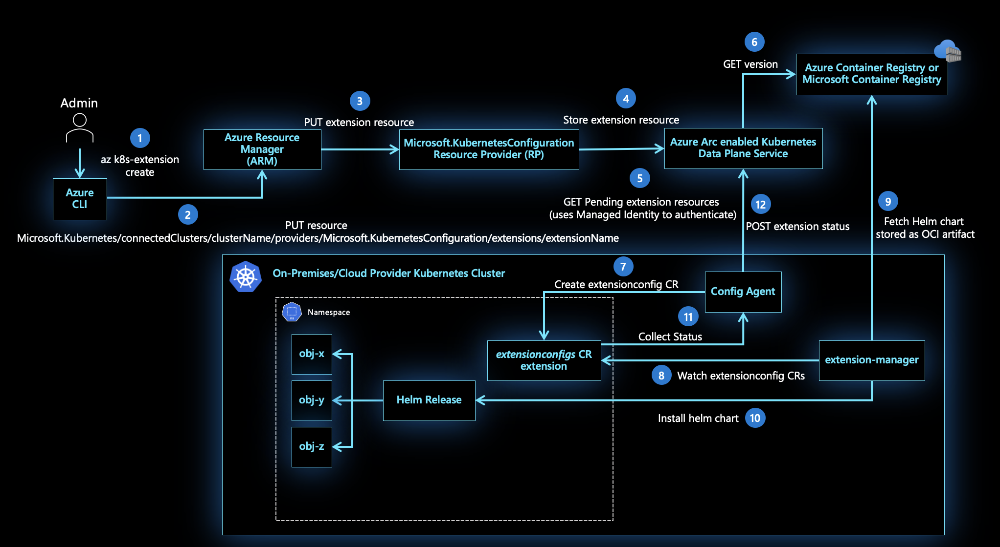

    [*Ref: K8s-Extensions*](https://docs.microsoft.com/en-us/azure/azure-arc/kubernetes/conceptual-extensions#architecture)

    - Different extensions for different Service types to be deployed on the K8s Cluster
      - *App Service Extension* - Includes Web Apps/API Apps, Logic Apps, Function Apps
      - *EventGrid Extension* - Supports EventGrid Topic deployment
      - *Data Service Extension* - Supports deployment of SQL MI
    - *config-agent* - Keeps track fo new or updated extension resources. Multiple extensions can be added on the same cluster with different versions
    - *extension-manager* - Pulls Helm chart from Container Registry and deploys onto the K8s cluster

    

22. **Retrieve** the *ExtensionId* to be used in subsequent steps

    ```bash
    extensionId=$(az k8s-extension show \
      --cluster-type connectedClusters \
      --cluster-name $connectedClusterName \
      --resource-group $arcResourceGroupName \
      --name $appsvcExtensionName \
      --query id \
      --output tsv)
    echo $extensionId
    
    # Check Pods created in teh extensionNamespace
    k get po -n $appsvcExtensionNamespace
    ```

23. **Create** *CustomLocation* with Azure Arc Connected Cluster

    - Every *Application Services* or *Data Services* would be deployed in the *CustomLocation* rather than an Azure Region/Location

    - This would ensure various types of application and data services can run together in same Arc Enabled Cluster

      ```bash
      connectedClusterId=$(az connectedk8s show --resource-group $arcResourceGroupName --name $connectedClusterName --query id --output tsv)
      echo $connectedClusterId
      
      az customlocation create \
      --resource-group $arcResourceGroupName \
      --name $customLocationName \
      --host-resource-id $connectedClusterId \
      --namespace $appsvcExtensionNamespace \
      --cluster-extension-ids $extensionId
      ```

      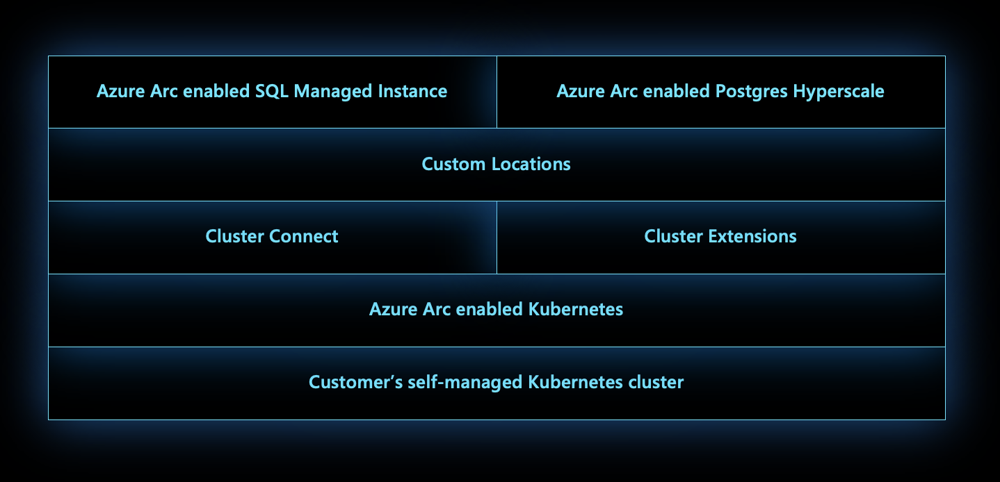

      [*Ref: Custom Location*](https://docs.microsoft.com/en-us/azure/azure-arc/kubernetes/conceptual-custom-locations#architecture)

      - Target Location for all services
      - As evident from the diagram - it is a layer around Azure Arc enabled K8s
      - Ideally one custom location per k8s cluster
      - Every allowed services on Azure Arc would be deployed to this Custom Location; instead of an Azure region 
      - Creates K8s *ClusterRoleBindings* and *RoleBindings*
      - This will ensure that Azure Arc enabled K8s can deploy necessary resources viz. pods, services, replicates, statefulsets etc.) for the deployed application services i.e. API Apps, FunctionApps, Logic Apps etc.

24. **Check** the status of CustomLocation creation process

    ```bash
    az customlocation show --resource-group $arcResourceGroupName --name $customLocationName
    ```

25. **Retrieve** the *CustomLocationId* to be used in subsequent steps

    ```bash
    customLocationId=$(az customlocation show \
    --resource-group $arcResourceGroupName \
    --name $customLocationName \
    --query id \
    --output tsv)
    echo $customLocationId 
    ```

26. **Create** *App Service Kube Environment* for the above *CustomLocation*

    - This is a collection of all *App Service Plans* and *App Services*

    - Please note that this is only needed for Application Services; for Data Services thsi would be performed by Data Controllers for Arc

      ```bash
      az appservice kube create \
      --resource-group $arcResourceGroupName \
      --name $appsvcKubeEnvironmentName \
      --custom-location $customLocationId
      ```
    
27. **Check** *Kube Environment* creation process

    ```bash
    az appservice kube show \
    --resource-group $arcResourceGroupName \
    --name $appsvcKubeEnvironmentName
    ```


#### Use Case Flow

##### Zip Images

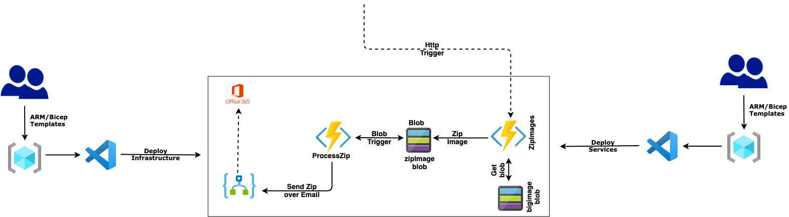

This is what we would like to achieve in this exercise on the Custom Location created above:

- Deploy a .NetCore Http triggerred Function App - **ZipImagesArcApp**
- Deploy a Locally developed Blob triggered Logic App - **NotifyZipArcLA** Logic App
- Deploy an EventGrid topic **aks-k8s-arc-cluster-ext-eg-evg-topic**
- **Test**
  - Upload Images to the Blob -viz.  *bigimgeblob*
  - Call Http triggererd function Url of *ZipImagesArcApp* passing the arrya iof image names in the 
  - Push an event to EventGrid topic from PostMan or any other Rest client
  - Check that the corresponding Subscription Endpoint (e.g. ***NotifyZipArcLA***) is fired!

#### Function App

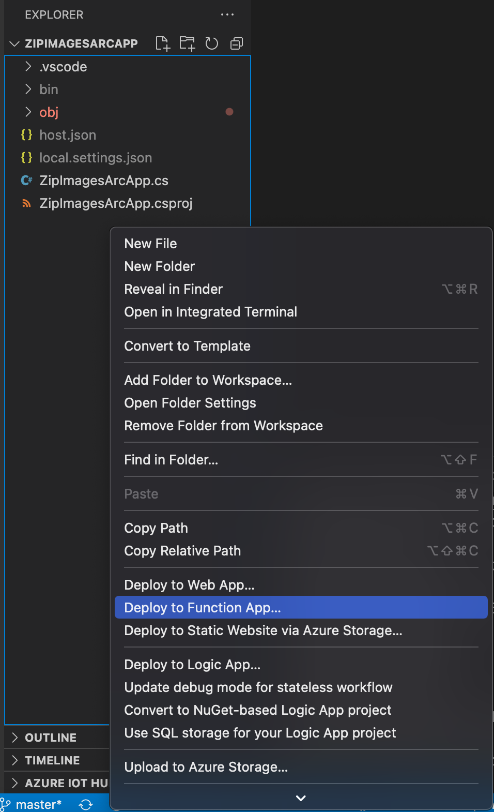

- This execise uses a simple *Http Triggerred* Azure Function in .NetCore - **ZipImagesArcApp** for this purpose. One can use any type of Azure Function of their choice
- Visual Studio Code or Visual Studio both have easy integration with Azure Resource management. Any other IDE with appropriate plugins can be used as well. This exercise would use VSCode as an option
- Open Function App  root folder in Visual Studio Code
- Right Click and **Deploy** to Function App. Please note one can create the Function App in the portal and then manage deployment from VSCode
- VSCode would ask for a new App to be Created Or Deploy on an existing one
- The Target Location step is extremely important - ***should be the <u>CustomLocation</u> created in earlier steps***
- Once the steps are completed, comeback to Azure CLI
- Check *Deployments* and/or *Pods* of the App Service Namespace in the K8s cluster. All Pods should be in the running state
- Go to Azure Portal and Check the Function App  resource; in the Overview blade it will show up the Web API access URL
- Check the URL in the browser; use Postman or any REST client to call to test different paths of the Function App

#### Logic App

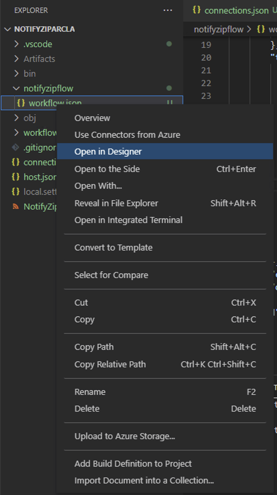

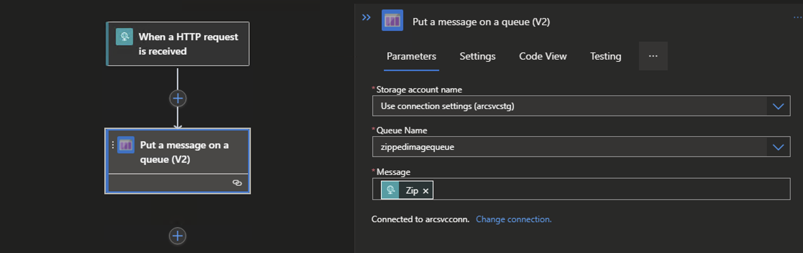

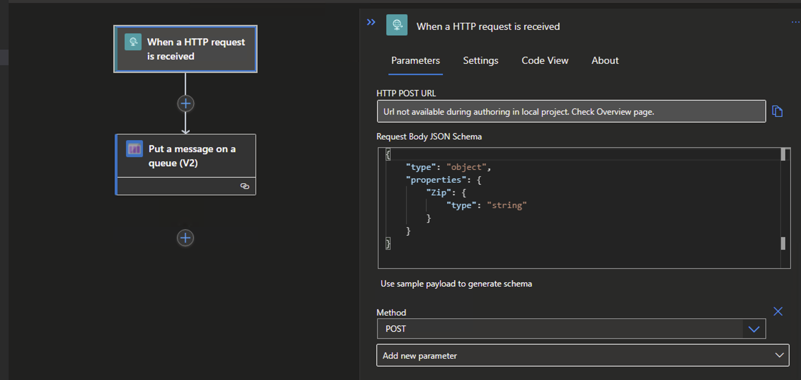

- This execise uses a simple *Http Triggerred* Logic App Created Locally - **NotifyZipArcLA** for this purpose
- Few points to note here on the choice of Creation path to Azure and subsequent Deployment onto K8s cluster
  - This Logic App type would be **<u>Standard</u>** and **Stateful** which is actually a **<u>Single Tenant Logic App</u>**; rather than the *Consumption* type Logic App which is *Multi-Tenant* Logic App
  - Currently the best way to achieve a seamless experiene end-to-end is to Create and Deploy Logic App Standard, Stateful type from Visual Studio Code itself
  - Not all triggers are available for **Standard** mode as of now
  - This exercise uses a simple *Blob trigger* for demonstration
- Visual Studio Code or Visual Studio both have easy integration with Azure Resource management. Any other IDE with appropriate plugins can be used as well. This exercise would use VSCode as an option
- Open Logic  App  root folder in Visual Studio Code
- Right Click and **Deploy** to Logic App
- VSCode would ask for a new App to be Created Or Deploy on an existing one
- The Target Location step is extremely important - ***should be the <u>CustomLocation</u> created in earlier steps***
- Once the steps are completed, comeback to Azure CLI
- Check *Deployments* and/or *Pods* of the App Service Namespace in the K8s cluster. All Pods should be in the running state
- Uplaod some blob images and check that the Logic App worlflow gets triggered

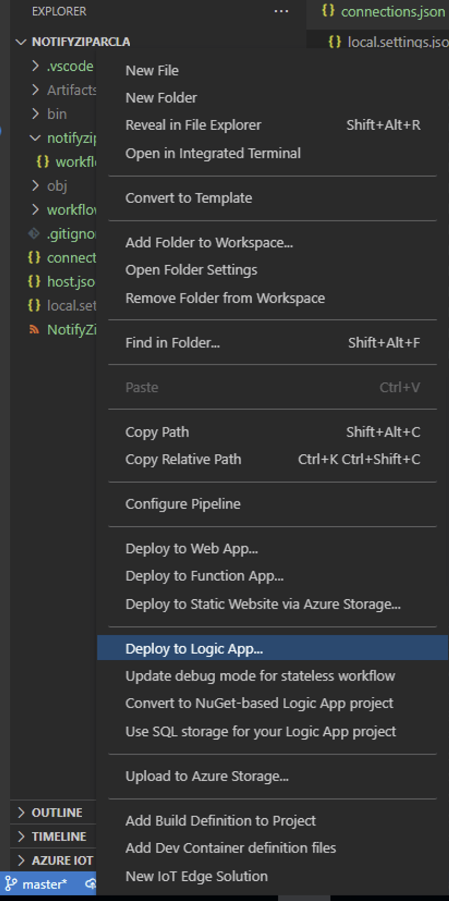


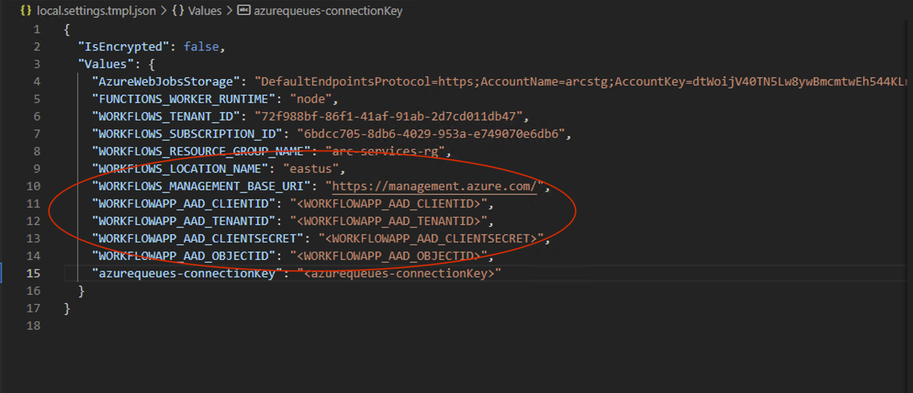


#### Event Grid

- This exercise uses a simple *Event Grid Topic* - **aks-k8s-arc-cluster-ext-eg-evg-topic** for this purpose

- Set local varibales in Azure CLI

  ```bash
  evgExtensionName="$clusterName-ext-eg"
  evgExtensionNamespace="$clusterName-evg-ns"
  evgTopicName="$clusterName-egt"
  evgSubscriptionName="$clusterName-evg-sub"
  ```

- **Create** *Event Grid* extension for Azure Arc on K8s

  This step is easy to be done through portal as there are many config options - https://docs.microsoft.com/en-us/azure/event-grid/kubernetes/install-k8s-extension

- Check the event Grid extension creation process

  ```bash
  az k8s-extension show -c $connectedClusterName --cluster-type connectedClusters \
  -n $evgExtensionName -g $arcK8sResourceGroup
  ```

  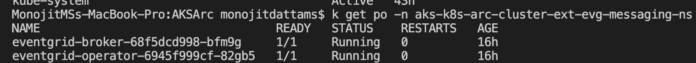

  

  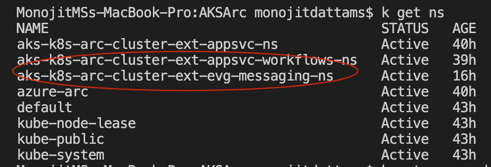

  

  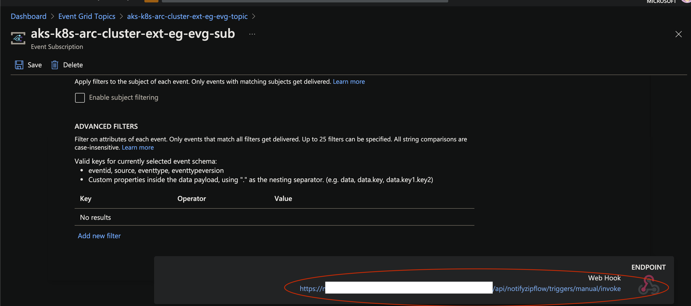

  

  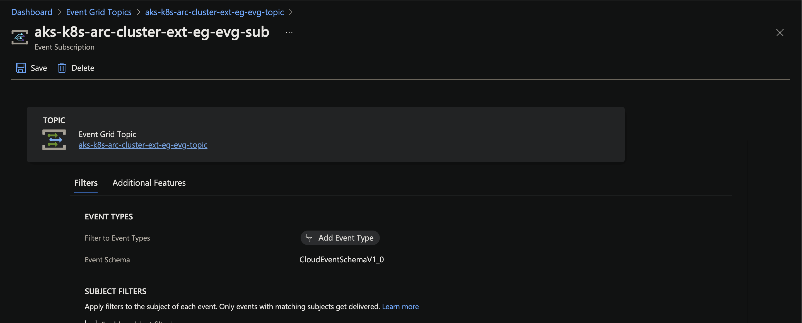

  

  **<u>Arc Enabled Services</u>**

- Make sure to Select the EventGrid service from the dropdown before creating the EventGrid Topic - otherwise Topic creation would fail with Forbidden error; as it would not recognize the target deployment Location - which should be the *Custom Location* in the case

- Visual Studio Code or Visual Studio both DONOT have integration with Azure Arc flavour for EventGrid as of now. So, creating the Topic in portal is the only option as of now 

- The Target Location step is extremely important - ***should be the <u>CustomLocation</u> created in earlier steps***

- **Check** *Topic* details

  ```bash
  topicId=$(az eventgrid topic show --name $evgTopicName --resource-group $arcSvcResourceGroup --query id -o tsv)
  echo $topicId
  ```

- Create *Event Subscription* for the above topic

  ```bash
  az eventgrid event-subscription create --name $evgSubscriptionName --source-resource-id $topicId \
  --endpoint <event_subscription_endpoint>
  
   # e.g. function app endpoint that we had created earlier
  ```

- Check *Deployments* and/or *Pods* of the EventGrid Namespace in the K8s cluster. All Pods should be in the *running* state

  ```bash
  k-capz get po -n $eventGridnamespace
  ```

- Get EventGrid **Endpoint** details

  ```bash
  eventGridEndpoint=$(az eventgrid topic show --name $evgTopicName -g $arcSvcResourceGroup --query "endpoint" --output tsv)
  ```

- Get EventGrid **Key** details

  ```bash
  eventGridKey=$(az eventgrid topic key list --name $evgTopicName -g $arcSvcResourceGroup --query "key1" --output tsv)
  ```

- Following piece of code would be executed when a POST call is made for the **/upload** endpoint

  - Send the EventGrid **Endpoint** in Http request header as key - **ep**; e.g. ***ep = "<value>"***
  - Send the EventGrid **Key** in Http request header as key - **key**; e.g. ***key = "<value>"***
  - Only supported Event Schema as of now - **CloudEvent Schema**; *EventGrid Schema* will not work currently!

  ```javascript
  express.post("/upload", async (request, response) =>
  {
  
      try
      {
  
          const requestHeaders = request.headers;
          const evgHeaders =
          {
  
              "Content-Type": "application/cloudevents-batch+json",
              "aeg-sas-key": requestHeaders.key
  
          };
  
          const config =
          {
  
              headers: evgHeaders
  
          };
  
          const data =
          { 
              "specversion": "1.0",
              "type" : "orderCreated",
              "source": "myCompanyName/us/webCommerceChannel/myOnlineCommerceSiteBrandName",
              "id" : "eventId-n",
              "time" : "2020-12-25T20:54:07+00:00",
              "subject" : "account/acct-123224/order/o-123456",
              "dataSchema" : "1.0",
              "data" : {
                 "orderId" : "123892",
                 "orderType" : "PO",
                 "reference" : "https://www.myCompanyName.com/orders/123"
                }
          };
  
          const result = await Axios.post(requestHeaders.ep, [data], config);
          console.log(result);
          response.send("PostAPIApp - " + result.data);
          
      }
      catch(exception)
      {
  
          response.send("Error - " + exception.message);
  
      }
  ```

  

- This in-turn calls the subscription endpoint; check if the **PostMessageApp** Function being called


#### Additional Points

- The same exercise would work for AKS cluster also almost as-is
- [PersistentVolume](#Helms) Step through Helm chart would NOT be needed. AKS being a mangled Cluster - it would come-up with a set of *Storage Classes*
- Repository for this [Source Code](https://github.com/monojit18/K8s-Arc.git)

## References

**Azure Arc Enabled K8s**:

- https://docs.microsoft.com/en-us/azure/azure-arc/kubernetes/
- https://docs.microsoft.com/en-us/azure/azure-arc/kubernetes/conceptual-agent-architecture
- https://docs.microsoft.com/en-us/azure/azure-arc/kubernetes/conceptual-extensions
- https://docs.microsoft.com/en-us/azure/azure-arc/kubernetes/conceptual-cluster-connect
- https://docs.microsoft.com/en-us/azure/azure-arc/kubernetes/conceptual-custom-locations

**AppServices on K8s**

- https://docs.microsoft.com/en-us/azure/app-service/quickstart-arc
- https://docs.microsoft.com/en-us/azure/app-service/overview-arc-integration
- https://docs.microsoft.com/en-us/azure/app-service/manage-create-arc-environment

**EventGrid on K8s** 

- https://docs.microsoft.com/en-us/azure/event-grid/kubernetes/
- https://docs.microsoft.com/en-us/azure/event-grid/kubernetes/create-topic-subscription

**DataServices on K8s**

- https://docs.microsoft.com/en-us/azure/azure-arc/data/overview
- https://docs.microsoft.com/en-us/azure/azure-arc/data/create-data-controller-direct-cli
- https://docs.microsoft.com/en-us/azure/azure-arc/data/create-sql-managed-instance


